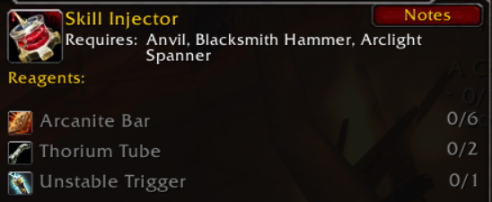

# Engineering

#### To add recipes to Engineering use the skill line ID 202 in SkillLineAbility.DBC 

#### &#x20;

Schematic: Skill Injector

Recipe ID 5041

Quest reward from Dreegz Knutz in Molten Core

Crafting Spell ID 80810

[zz\_schematic\_skill\_injector.SQL](file:///C:/Users/Viktor/.config/joplin-desktop/resources/1c57155839a04c1d8c28776b8f23bebe.SQL)

#### Schematic: Elementium Targeting Matrix 

Recipe ID 1492

Drops from Flamemaw, Ebonroc and Flamegor in BWL

Crafting Spell ID 80812

[zz\_schematic\_elementium\_targeting\_matrix.SQL](file:///C:/Users/Viktor/.config/joplin-desktop/resources/a36525060e314d058ab4b22e97ae7d77.SQL)

***

#### Schematic: Thorium headed arrows 

Recipe ID 23885

Drops from Emperor Dagran Thaurissan in BRD

Crafting Spell ID 30555

[zz\_schematic\_thorium\_headed\_arrows.SQL](file:///C:/Users/Viktor/.config/joplin-desktop/resources/cac04529c2774675a7df0fc86b94e6bf.SQL)

***

## Scavenging Mobs 

Adding Engineering loot tables to low level mechanicals.

Add a skinning loot table and set the creature type flag to be engineerable.

## Lvl 1-15 

Loot table ID #100018

|                         |      |          |
| ----------------------- | ---- | -------- |
| Item                    | ID   | % Chance |
| Copper Tube             | 4361 | 20       |
| Handful of Copper Bolts | 4359 | 20       |
| Copper Modulator        | 4363 | 20       |
| Copper Bar              | 2840 | 20       |
| Rough Blasting Powder   | 4357 | 20       |

|   |             |                     |
| - | ----------- | ------------------- |
| # | Creature ID | Name                |
| 1 | 36          | Harvest Golem       |
| 2 | 114         | Harvest Watcher     |
| 3 | 480         | Rusty Harvest Golem |

***

### Lvl 16 - 25 

Loot table ID #100021

|                        |      |          |       |
| ---------------------- | ---- | -------- | ----- |
| Item                   | ID   | % Chance | Group |
| Iron Strut             | 4387 | 20       | 0     |
| Bronze Framework       | 4382 | 20       | 0     |
| Gyrochronatom          | 4389 | 20       | 0     |
| Copper Modulator       | 4363 | 20       | 0     |
| Bronze Tube            | 4371 | 20       | 0     |
| Bronze Bar             | 2841 | 50       | 1     |
| Coarse Blasting Powder | 4364 | 50       | 1     |

|   |             |                           |
| - | ----------- | ------------------------- |
| # | Creature ID | Name                      |
| 1 | 642         | Sneed's Shredder          |
| 2 | 2676        | Compact Harvest Reaper    |
| 3 | 6233        | Mechanized Sentry         |
| 4 | 4073        | XT:4                      |
| 5 | 6669        | The Threshwackonator 4100 |
| 6 | 573         | Foe Reaper 4000           |
| 7 | 115         | Harvest Reaper            |
| 8 | 4074        | XT:9                      |
| 9 | 7849        | Mobile Alert System       |

***

[zz\_mobs\_engineerable.sql](file:///C:/Users/Viktor/.config/joplin-desktop/resources/7928bfc11d4e4499b87cded157ec84f3.sql)

[zz\_loot\_engineered.sql](file:///C:/Users/Viktor/.config/joplin-desktop/resources/dbdaba8dc84e47fc9b707c27eaab139e.sql)

***
